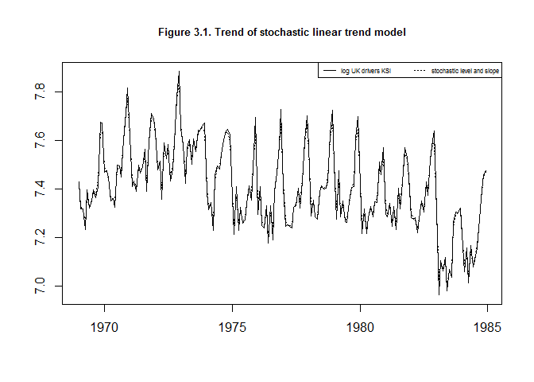
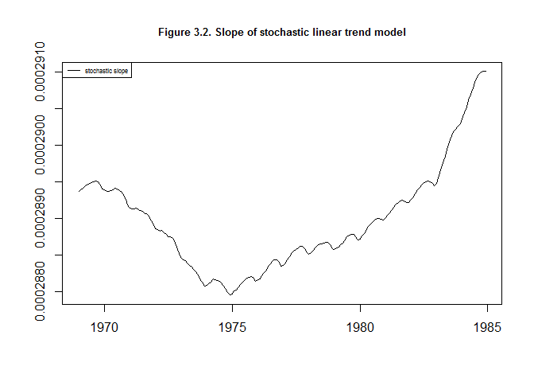

This repository provides code in R reproducing examples of the states space models presented in book ["An Introduction to State Space Time Series Analysis"](http://www.ssfpack.com/CKbook.html) by Jacques J.F. Commandeur and Siem Jan Koopman.


The repository uses extensively the [KFAS package](https://cran.r-project.org/web/packages/KFAS/index.html) of Jouni Helske which includes computationally efficient functions for Kalman filtering, smoothing, forecasting, and simulation of multivariate exponential family state space models. Additionally, some own functions has been created to facilitate the calculation and presentation of diagnostics.

The code is provided in file "SSM.R" and split into sections corresponding to the following parts of the book:

-   Introduction
-   Chapter 2 The Local Level Model
-   Chapter 3 The Local Linear Trend Model
-   Chapter 4 The Local Level Model with Seasonal
-   Chapter 5 The Local Level Model with Explanatory Variable
-   Chapter 6 The Local Level Model with Intervention Variable
-   Chapter 7 The UK Seat Belt and Inflation Models
-   Chapter 8 General Treatment of Univariate State Space Models
-   Chapter 9 Multivariate Time Series Analysis

In R Studio, each section of the code can be executed with keys CTRL+ALT+T, after placing a cursor in that section. Please make sure to execute the first section of the code including the own defined functions that are used by the other sections of the code.

Below, the code of the stochastic level and slope model of chapter 3 is shown as an example.

Loading data on UK drivers killed or seriously injured (KSI):

``` r
dataUKdriversKSI <- log(read.table("UKdriversKSI.txt")) %>% 
  ts(start = 1969, frequency = 12)
```

Defining the model using function `SSModel()` of the KFAS package:

``` r
model <- SSModel(dataUKdriversKSI ~ SSMtrend(degree = 2, 
         Q = list(matrix(NA), matrix(NA))),  H = matrix(NA))
ownupdatefn <- function(pars, model){
  model$H[,,1] <- exp(pars[1])
  diag(model$Q[,,1]) <- exp(pars[2:3])
  model
}
(model)
#> Call:
#> SSModel(formula = dataUKdriversKSI ~ SSMtrend(degree = 2, Q = list(matrix(NA), 
#>     matrix(NA))), H = matrix(NA))
#> 
#> State space model object of class SSModel
#> 
#> Dimensions:
#> [1] Number of time points: 192
#> [1] Number of time series: 1
#> [1] Number of disturbances: 2
#> [1] Number of states: 2
#> Names of the states:
#> [1]  level  slope
#> Distributions of the time series:
#> [1]  gaussian
#> 
#> Object is a valid object of class SSModel.
```

Providing the number of diffuse initial values in the state:

``` r
d <- q <- 2 
```

Defining the number of estimated hyperparameters (two state disturbance variances + irregular disturbance variance):

``` r
w <- 3
```

Providing the autocorrelation lag l for r-statistic (ACF function):

``` r
l <- 12
```

Defining the first k autocorrelations to be used in Q-statistic:

``` r
k <- 15
```

Providing the number of observations:

``` r
n <- 192
```

Fitting the model using function `fitSSM()` and extracting the output using function `KFS()` of the KFAS package:

``` r
fit <- fitSSM(model, inits = log(c(0.001, 0001, 0001)), method = "BFGS")
outKFS <- KFS(fit$model, smoothing = c("state", "mean", "disturbance"))
```

Extracting the maximum likelihood using function `logLik()` of the KFAS package:

``` r
(maxLik <- logLik(fit$model)/n)
#> [1] 0.6247902
```

Calculating the Akaike information criterion (AIC):

``` r
(AIC <- (-2*logLik(fit$model)+2*(w+q))/n)
#> [1] -1.197497
```

Extracting the maximum likelihood estimate of the irregular variance:

``` r
(H <- fit$model$H)
#> , , 1
#> 
#>            [,1]
#> [1,] 0.00211807
```

Extracting the maximum likelihood estimate of the state disturbance variances for level and slope:

``` r
(Q <- fit$model$Q)
#> , , 1
#> 
#>           [,1]         [,2]
#> [1,] 0.0121285 0.000000e+00
#> [2,] 0.0000000 2.774437e-09
```

Extracting the initial values of the smoothed estimates of states using function `coef()` of the KFAS package:

``` r
smoothEstStat <- coef(outKFS)
(initSmoothEstStat <- smoothEstStat[1,])
#>        level        slope 
#> 7.4157359290 0.0002893677
```

Extracting the values for trend (stochastic level + slope) using function `signal()` of the KFAS package:

``` r
trend <-signal(outKFS, states = "trend")$signal
head(trend, 24)
#>           Jan      Feb      Mar      Apr      May      Jun      Jul
#> 1969 7.415736 7.330297 7.312187 7.261499 7.371391 7.331428 7.353890
#> 1970 7.491953 7.473422 7.440664 7.363989 7.360783 7.350545 7.478187
#>           Aug      Sep      Oct      Nov      Dec
#> 1969 7.388317 7.376828 7.435665 7.639474 7.644703
#> 1970 7.490569 7.474472 7.601383 7.708188 7.775278
```

Showing Figure 3.1. of the book for trend of stochastic linear trend model:

``` r
plot(dataUKdriversKSI , xlab = "", ylab = "", lty = 1)
lines(trend, lty = 3)
title(main = "Figure 3.1. Trend of stochastic linear trend model", cex.main = 0.8)
legend("topright",leg = c("log UK drivers KSI", "stochastic level and slope"), 
       cex = 0.5, lty = c(1, 3), horiz = T)
```



Showing Figure 3.2. of the book for slope of stochastic linear trend model:

``` r
plot(smoothEstStat[, "slope"], xlab = "", ylab = "", lty = 1)
title(main = "Figure 3.2. Slope of stochastic linear trend model", 
      cex.main = 0.8)
legend("topleft",leg = "stochastic slope", 
       cex = 0.5, lty = 1, horiz = T)
```



Extracting auxiliary irregular residuals (non-standardised) using function `residuals()` of the KFAS package:

``` r
irregResid <- residuals(outKFS, "pearson") 
```

Showing Figure 3.3. of the book for irregular component of stochastic trend model:

``` r
plot(irregResid  , xlab = "", ylab = "", lty = 2)
abline(h = 0, lty = 1)
title(main = "Figure 3.3. Irregular component of stochastic trend model", cex.main = 0.8)
legend("topright",leg = "irregular",cex = 0.5, lty = 2, horiz = T)
```


Extracting one-step-ahead prediction residuals (standardised) using function `rstandard()` of the KFAS package and calculating diagnostic for these residuals using own defined functions `qStatistic()`, `rStatistic()`, `hStatistic()` and `nStatistic()`:

``` r
predResid <- rstandard(outKFS) 
qStat <- qStatistic(predResid, k, w)
rStat <- rStatistic(predResid, d, l)
hStat <- hStatistic(predResid, d)
nStat <- nStatistic(predResid, d)
```

Showing Table 3.2 of the book for diagnostic tests for the local linear trend model applied to the log of the UK drivers KSI using own defined function `dTable()`:

``` r
title = "Table 3.2 Diagnostic tests for the local linear trend model applied to \n
the log of the UK drivers KSI"
dTable(qStat, rStat, hStat, nStat, title)
#> Table 3.2 Diagnostic tests for the local linear trend model applied to 
#> 
#> the log of the UK drivers KSI
#> -----------------------------------------------------------------------------
#>                     statistic    value   critical value   asumption satisfied
#> -----------------------------------------------------------------------------
#> independence           Q(15)   100.609            22.36        -
#>                         r(1)     0.005           +-0.15        +
#>                        r(12)     0.532           +-0.15        -
#> homoscedasticity       H(63)     1.058             1.65        +
#> normality                  N    14.946             5.99        -
#> -----------------------------------------------------------------------------
```
